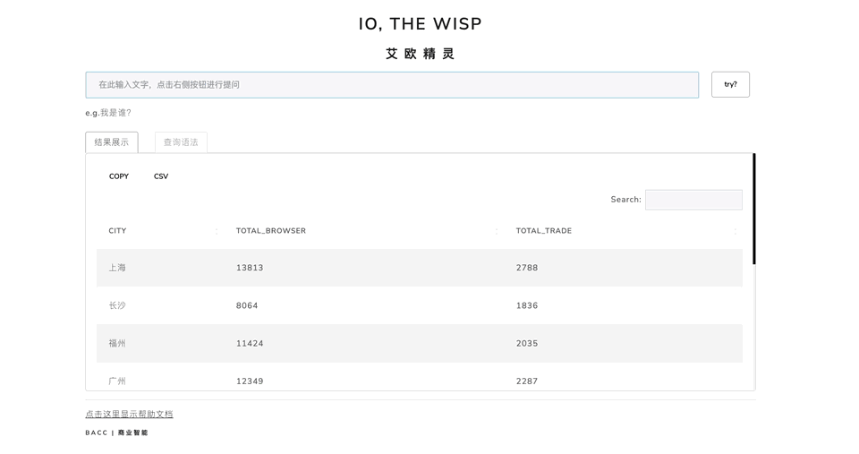

<div align="center">

<p><a href="http://127.0.0.1:7111/" target="_blank"></a></p>

DEMO ➫ [🔗 io-the-wisp](http://127.0.0.1:7111/)

</div>

---

# 项目简介
这是一个自然语言取数工具，利用`Gemini`模型将自然语言指令转换为SQL语句，从数据库中提取数据并展示到前端。


---

# 使用流程

#### 1. 配置`config.yml`
配置主路径下的`config.yml`文件，具体参照如下示例：

```yaml
default:
    seed: 123 # no use

# 数据库连接配置，项目默认使用Mysql数据库，将“xxxx”替换为你的实际连接配置
database:
    host: xxxxxx 
    user: xxxxxx
    pwd: xxxxxx
    database: xxxxxx
    port: xxxxxx
    

# 默认连接database中配置的数据库，进行建表和插入数据
# 用于记录用户查询结果，方便后续有针对性的优化prompt
cache:
    dbname: xxxxxx
    tblname: "io_the_wisp_propmt" # 默认的表名，也可以自定义

# 模型参数配置
gemini:
    api_token: "xxxxx"  # 替换为你的Gemini API token
    domain: "https://generativelanguage.googleapis.com/v1beta/models/"  # Gemini接口
    text_model: "gemini-pro:generateContent"  # 选用文本生成模型
    temperature: 0
    topK: 1
    topP: 1
    maxOutputTokens: 2048
    embedding_model: "embedding-001:embedContent" # 选用embedding模型
    
# prompt模板相关配置
template:
    folder: templates # prompt模板存放位置
    embeddings: embeddings.csv  # prompt模板embeding后的存储文件格式（默认在主目录）

```

---

#### 2. 配置prompt模板
prompt模板存储在`templates/`路径下，每个`xxx.txt`文件是一个模板，它将作为`查询问题`的上文一起提交给模型，为了让模型生成理想的SQL语句，我们需要告诉它每个数据表中的字段含义以及一些查询示例，比如：
```txt
任务目标：理解以下mysql表中的字段信息以及查询语句示例，根据Query写出sql代码。

数据表名称: datasets_io_the_wisp_channel,该表中记录了渠道获客数据

字段名称: date,city,channel,browser,trade

字段含义：日期=date,城市或地区=city,渠道=channel,浏览用户量或UV=browser,获客用户量或支付用户量=trade

Query: 从渠道获客统计表，统计各个渠道在2024年1月份的获客数量以及转化率CVR，按CVR降序排序

SQL: SELECT channel, SUM(trade) as total_trade, SUM(trade)/SUM(browser) AS cvr FROM datasets_io_the_wisp_channel WHERE date >= '2024-01-01' and date <= '2024-01-31'  GROUP BY channel ORDER BY SUM(trade)/SUM(browser)  DESC;

Query: 从渠道获客统计表，查出转化率前三的渠道

SQL: SELECT channel, SUM(trade) / SUM(browser) AS cvr FROM datasets_io_the_wisp_channel GROUP BY channel ORDER BY SUM(trade) / SUM(browser) DESC LIMIT 3;

Query: {prompt}
SQL: 
```
- 后续我们可以通过分析捕获到的用户查询结果有针对性的优化prompt模板或者提供更多的查询示例，来让结果达到满意状态
- 用户的每次查询结果已经被存储到了数据库表中（即`config.yml`中配置的`cache`:`tblname`）

---

#### 3. Prompt模板创建和更新
如你所见，一个prompt模板只对一张数据表进行解释说明，所以你需要根据自身数据表建设情况，对每张数据表都创建一个prompt模板，这样设计的优点和缺点：  

- **优点**
  - 当查询场景和数据表较多时，分成多个模板可以避免提示词长度受限；
  - 提供较短但与问题强相关的上文（对单表的解释）比提供全面但缺乏针对性的上文（对多表的解释）更有利于模型理解问题并给出相对准确的结果
  
- **缺点**
  - 问题与模板的匹配是基于语义相似度，有时会找不准模板
  
##### <mark>注意</mark>：
  
- 每次创建模板或更新模板后，都需要运行`update.R`脚本，作用是将模板内容进行embedding后存储到`embedding.csv`文件

- 创建prompt模板时，`.txt`的文件名也很重要，它会作为内容标题输入embedding模型，所以文件名最好是对模板内容的概要性总结，例如`渠道获客统计.txt`


---

#### 4. 项目启动
在终端内，项目路径下执行shell命令：`sh run.sh`，或Rstudio中运行`app.R`脚本
